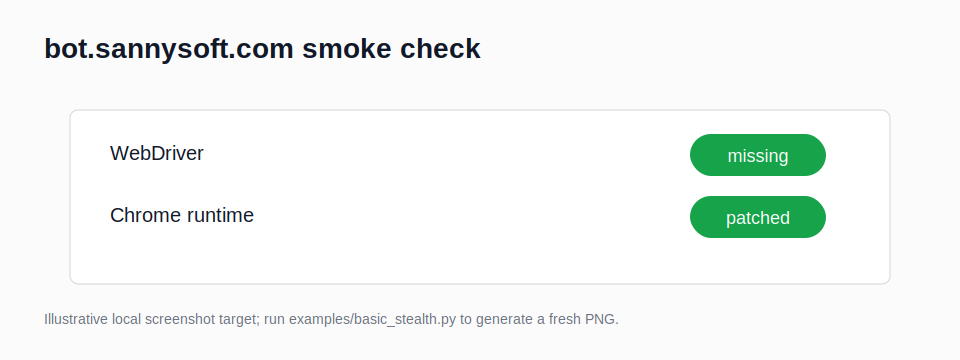

# playwright-cloudflare

Playwright stealth defaults for authorized browser testing: launch args,
`add_init_script` patches, persistent Chrome profiles, explicit sync helpers, and
opt-in fingerprint profile controls, machine-readable audit reports, and pytest fixtures
for your own Playwright test suite.



**Disclaimer:** For authorized testing and your own properties only. Respect robots.txt and
Terms of Service. Do not use this to access sites that prohibit automated access. No CAPTCHA
solving, proxy rotation, credential stuffing, or platform-specific bypass is included. See
[DISCLAIMER.md](DISCLAIMER.md) before use.

## Install

```bash
pip install playwright-cloudflare
playwright install chromium
```

The package keeps the no-extra-stealth-dependency design: Playwright is the only runtime
dependency.

For pytest integration:

```bash
pip install "playwright-cloudflare[test]"
```

## Sync Usage

Use the explicit sync helpers with Playwright's sync API:

```python
from playwright.sync_api import sync_playwright
from pw_stealth import stealth_context_sync

with sync_playwright() as p:
    ctx = stealth_context_sync(p, headless=False)
    page = ctx.new_page()
    page.goto("https://bot.sannysoft.com", wait_until="networkidle")
    page.screenshot(path="sannysoft.png", full_page=True)
    ctx.close()
```

For an existing sync `Page` or `BrowserContext`, install the init script directly:

```python
from pw_stealth import apply_stealth_sync

apply_stealth_sync(page)
```

The legacy `stealth_context`, `stealth_browser`, and `apply_stealth` imports remain
available for existing users.

## Fingerprint Profiles

`FingerprintProfile` is opt-in: only fields you set are applied. Locale and timezone values
are passed to Playwright context options and mirrored in init-script patches where browser
diagnostics commonly read them.

```python
from pw_stealth import FingerprintProfile, stealth_context_sync

profile = FingerprintProfile(
    locale="en-US",
    timezone_id="America/New_York",
    hardware_concurrency=8,
    device_memory=8,
    webgl_vendor="Google Inc.",
    webgl_renderer="ANGLE (Intel, Intel(R) UHD Graphics Direct3D11 vs_5_0 ps_5_0)",
    canvas_noise=True,
)

context = stealth_context_sync(p, fingerprint=profile, headless=True)
```

| Vector | Field | Applied through |
| --- | --- | --- |
| User agent | `user_agent` | Playwright context option |
| Viewport | `viewport` | Playwright context option |
| Locale and languages | `locale`, `languages` | Context option plus `navigator.language(s)` |
| Timezone | `timezone_id` | Context option plus `Intl.DateTimeFormat` |
| CPU threads | `hardware_concurrency` | `navigator.hardwareConcurrency` |
| Device memory | `device_memory` | `navigator.deviceMemory` |
| WebGL identity | `webgl_vendor`, `webgl_renderer` | WebGL `getParameter` patch |
| Canvas readout noise | `canvas_noise` | Canvas read APIs |

## Presets

`load_preset(name)` returns a ready-made, internally-consistent `FingerprintProfile`. Each
preset bundles the fingerprint vectors so they do not contradict each other — for example a
Chromium user agent always ships with a Google/ANGLE WebGL identity, while the Firefox
preset pairs a Gecko user agent with a `Mozilla` WebGL vendor.

```python
from pw_stealth import load_preset, stealth_context_sync

profile = load_preset("chrome")          # chrome | edge | brave | firefox
context = stealth_context_sync(p, fingerprint=profile, headless=True)
```

| Preset | Engine | User agent token | WebGL vendor | Locale / timezone |
| --- | --- | --- | --- | --- |
| `chrome` | chromium | `Chrome/125` | `Google Inc. (Intel)` | `en-US` / America/New_York |
| `edge` | chromium | `Edg/125` | `Google Inc. (NVIDIA)` | `en-US` / America/Chicago |
| `brave` | chromium | `Chrome/125` | `Google Inc.` | `en-US` / America/Los_Angeles |
| `firefox` | gecko | `Firefox/126` | `Mozilla` | `en-GB` / Europe/London |

`is_internally_consistent(name)` returns `True` when a preset's user agent, WebGL vendor,
engine, and locale/languages all agree — the same contract the presets are tested against.

## CLI

`pw-stealth check <url>` opens an authorized test page with stealth on and prints detection
signals such as `navigator.webdriver`, plugin count, languages, timezone, and WebGL values.

```bash
pw-stealth check https://example.com
pw-stealth check https://bot.sannysoft.com --no-headless --json
```

`pw-stealth profiles` lists the available fingerprint presets, and `--preset <name>` applies
one before checking:

```bash
pw-stealth profiles
pw-stealth check https://bot.sannysoft.com --preset firefox
```

`pw-stealth check --creepjs` opens a CreepJS-style detection page and reports the parsed
trust score and lie signals:

```bash
pw-stealth check --creepjs
pw-stealth check --creepjs --preset chrome --json
```

`pw-stealth audit <url>` writes a machine-readable report that is suitable for CI
regression checks of your own stealth setup. It captures the same defensive diagnostic
surfaces as the human check command, including `navigator.webdriver`, plugins, languages,
hardware concurrency, device memory, timezone, WebGL, and a small canvas readout hash.

```bash
pw-stealth audit https://example.com --preset chrome --json audit.json
pw-stealth audit https://bot.sannysoft.com --preset chrome --json current.json --compare baseline.json
pw-stealth audit https://abrahamjuliot.github.io/creepjs/ --creepjs --json creepjs-audit.json
```

When `--compare baseline.json` finds a changed signal, the command prints the diff and
exits `1`, which lets CI catch regressions in your own Playwright configuration.

## Pytest Fixtures

Install the optional test extra to expose `stealth_context` and `stealth_page` through
pytest's `pytest11` plugin entry point. The fixtures use the `browser` fixture from the
Playwright pytest plugin, create a fresh context, and install this package's stealth init
scripts before yielding.

```python
def test_authorized_diagnostic_page(stealth_page):
    stealth_page.goto("https://example.com")
    assert "Example" in stealth_page.title()
```

Override `stealth_fingerprint` in your suite when you want a specific
`FingerprintProfile` or preset-backed profile.

## Included

- `STEALTH_ARGS` without `--enable-automation`
- `STEALTH_INIT_JS` for `navigator.webdriver`, `window.chrome`, plugins, and languages
- Random desktop `Fingerprint` values for user agent, viewport, locale, and timezone
- Explicit sync helpers in `pw_stealth.sync_stealth`
- Opt-in `FingerprintProfile` vectors for WebGL, canvas, locale, timezone, CPU, and memory
- Internally-consistent `chrome` / `edge` / `brave` / `firefox` presets via `load_preset`
- `pw-stealth profiles`, `--preset <name>`, and a `--creepjs` trust/lie diagnostics check
- `pw-stealth audit` JSON reports with baseline compare mode for CI regression checks
- Optional pytest fixtures: `stealth_context`, `stealth_page`, and `stealth_fingerprint`
- Persistent Chrome profile support with `--profile-directory=...`

## Not Included

No CAPTCHA solver, no proxy rotation, no credential workflows, and no per-platform bypass
logic. For persistent session testing, use `channel="chrome"`, a real Chrome profile path,
and `headless=True` to add `--headless=new`.

Built by [baronguyen001](https://github.com/baronguyen001). Want the full
**scrape -> AI -> alert** bot, not just this piece? -> **[Trawlkit](https://github.com/baronguyen001/Trawlkit)**
(one-time kit).
